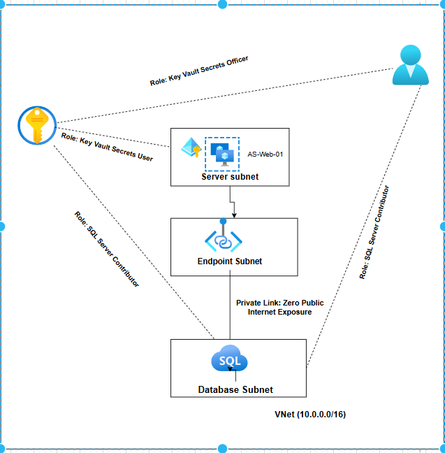

🛒 **RtlCorp Enterprise Landing Zone**

📌 The Project Goal

Architecting a secure, scalable, and modular Azure environment for a retail migration. This project demonstrates Zero-Trust networking, Identity-based Governance, and High Availability standards.

🗺️ **Architecture Diagram**
(Includes Private Link, Managed Identity, and RBAC Role Assignments)

🏗️ **Modular Structure**

This project is built using a Modular Design Pattern for maximum reusability:

- Networking Module: Defines the VNet, isolated Subnets, and Private Endpoint zones.

- Security Module: Manages Azure Key Vault with RBAC Authorization (removing legacy access policies).

- Data Module: Deploys a SQL Database with zero public exposure and RBAC management roles.

- Compute Module: Provisions Windows 2025 VMs with System-Assigned Managed Identities and Availability Sets.

🔐 **Advanced Security & Reliability**

Zero-Trust RBAC: Replaced legacy Access Policies with Azure RBAC roles (Secrets Officer, Secrets User).

Managed Identity: VMs authenticate to the Key Vault using Entra ID identities, eliminating the need for hardcoded service principal credentials.

Private Link: Database communication is 100% internal to the Microsoft backbone.

High Availability: Compute resources are protected by Availability Sets to ensure hardware fault tolerance.

🚀 **Deployment**

PowerShell
# 1. Set your secure password (injected into Key Vault via Terraform)
$env:TF_VAR_admin_password = "YourSecurePassword123!"

# 2. Initialize and Deploy
terraform init
terraform plan
terraform apply -auto-approve
